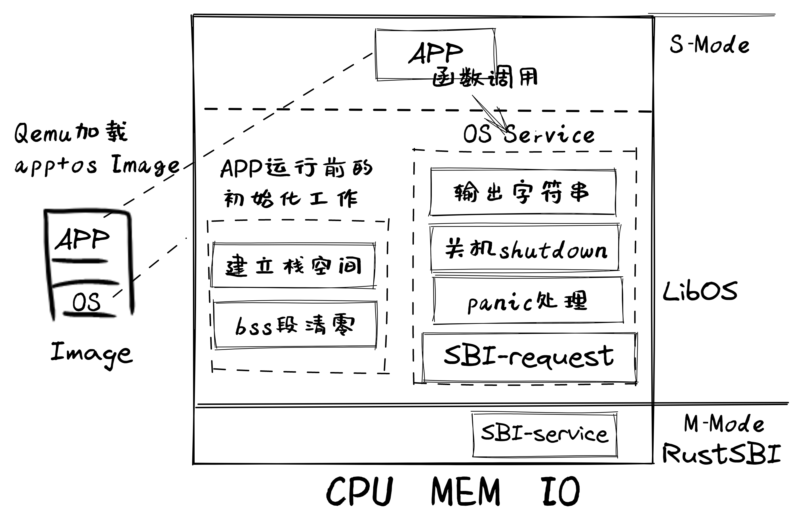

# rCore Learning Notes

## April/20/2023

### Ch01: LibOS

LibOS总体结构如图所示：

由上图可知，Qemu将包含app和LibOS的image镜像加载到内存中，RustSBI（bootloader）完成基本的硬件初始化后，跳转到LibOS起始位置，LibOS首先进行app执行前的初始化工作，即**建立栈空间**和**清零bss段**，然后跳转到app去执行。app在执行过程中，会通过函数调用的方式得到LibOS提供的OS服务，如输出字符串等，避免了app与硬件直接交互的繁琐过程。

S-Mode与M-Mode是RISC-V处理器架构的两种特权级别。S-Mode指的是Supervisor模式，是操作系统使用的特权级别，可以执行特权指令等。M-Mode是Machine模式，其特权级别比S-Mode还高，可以访问RISC-V处理器中所用的系统资源。

### 应用程序执行环境

通用操作系统上的应用程序运行需要下面多层次的执行环境栈的支持，下图白色块自上而下表示各级执行环境，黑色代表相邻两层执行环境之间的接口。

其中应用位于最上层，其可以通过调用编程语言提供的标准库或者其他三方库对外提供的函数接口，使得仅需少量的源代码就能完成复杂的部分。但这些库的功能不仅限于此，它们属于应用程序**执行环境**的一部分。

从操作系统内核角度来看，上面的一切都属于用户态软件，而它自身属于内核态软件。无论用户态应用如何编写，是手写汇编代码还是基于某种高级编程语言调用其标准库或三方库，某些功能总要直接或者间接地通过操作系统内核提供的**系统调用**（System Call）来实现。因此系统调用了充当用户和内核之间的边界。内核作为用户态软件的执行环境，不仅需要提供系统调用接口，还需要对用户态软件的执行进行监控和管理。
